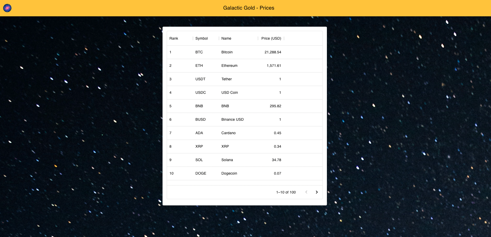

# Spring Crypto App

- Spring Boot, H2 Database, Reactive Web RESTful, Criteria Builder, ReactJs, MUI Materials, Axios
- Back-end serves at `http://localhost:8080`.
- Front-end serves at `http://localhost:3000`.
- To run back-end on local:
    - Find `src/main/java/com/denzhn/galacticgold/GalacticGoldApplication.java` and run the Main method.
- To run front-end on local:
    - At project's root folder run command: `cd frontend`
    - Then run command: `npm install`
    - If there are no errors, you are ready to run the front-end with: `npm start`

## User Interface

- User can filter, sort and list the coins by their names, prices etc.
- 

